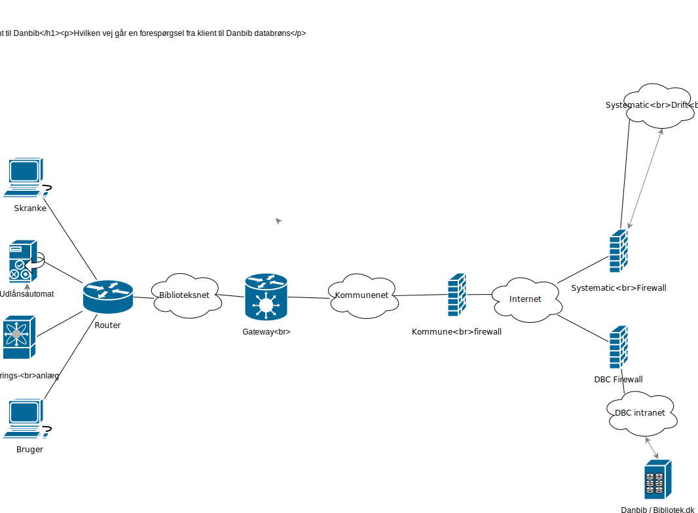
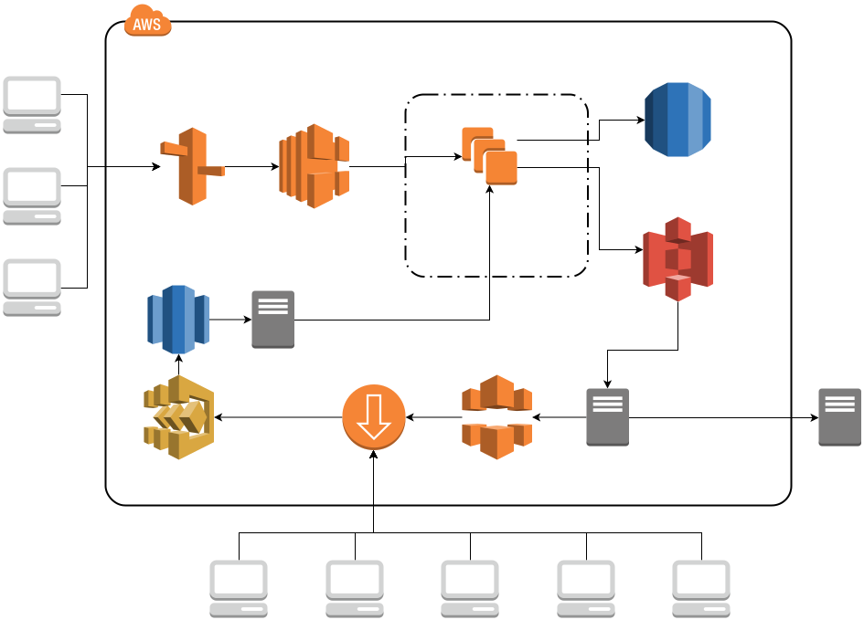

# diagrams
Testing integration to draw.io

<!--
Diagrams are created in /diagrams as SVG files using http://Draw.oi

Only for public repos

MarkDown:  
HTML: 

Relativ path: 

-->

## Arkitekturforskelle.mobil-desktop-OpenPlatform
{??}    Rolf? 
XML 
Svg 

## Client2Danbib_route
Invalid : 

### Client2Danbib_route.svg
{??}    Kan anvendes til at belyse svartider        

## Cover service architecture
### CoverServiceArchitecture.2018.svg
Brug    
I stedet for 

### CoverServiceArchitecture.svg
Brug   
I stedet for 

## DDB_infrastruktur_niveau0
### DDB_infrastruktur_niveau0.svg
Brug [danskernesdigitalebibliotek.github.io/ddb/DDB_infrastruktur_niveau0.html](https://danskernesdigitalebibliotek.github.io/ddb/DDB_infrastruktur_niveau0.html)

## DdbCoverService
### DdbCoverService.svg

Invalid 

## LibraryOrgStructure

## OpenPlatform.holdings

## OpenPlatform
{??}
    

## Untitle
{??}        

## aws
{??}        

## ereolen-authntification
authentification_sequence.puml

##  paste.xml
{SKIP}      

## routeLocal2Central.svg
{SKIP}          
---

## routeLocal2Central.svg - Datavej klient til Danbib brønd:
{SKIP}          

## CMScontent_wrapper

## diagrams/OpenPlatform/docs/holdings/OpenPlatform.holdings.svg
{SKIP}    ??    

## maalarkitektur

### Adgangsstyring.svg
{??}    Components  Rolf?   

### DDBCMS.2016-06-17.OpenPlatform.svg
{??}     Rolf? Tomt diagram     

### Materialevisning-Beholdning.svg)
{??}     Sekvens: ROLF? Materialevisning    

### OpenFormat.svg)
{SKIP}  Rolf? Skitse til OpenFormat (Uaktuel)   

### OpenFormatExample.md
{??}    
{SKIP}  Components   OpenPlatform på koncept niveau 

### Personalsering-user_consent.svg)
{??}    Swimlane: Rolf? Relevant??  

### Rec.js.svg)
{SKIP}  rec.js fælles platform mellem app/cms og Open Platform ??   

### Untitled Diagram.xml)   
{??}    Test i DrawIo       

### UserProfile.svg)
{SKIP}  Udkast til brugerprofil 

### UserProfile.xml)
{SKIP}  

### brugerlogin.biblo.svg)
{SKIP}  Sekvens: Rolf? Brugerlogin på Biblo.dk      

### components.total.svg)
{??}    Components. EBP:(Den Store Grimme)      
