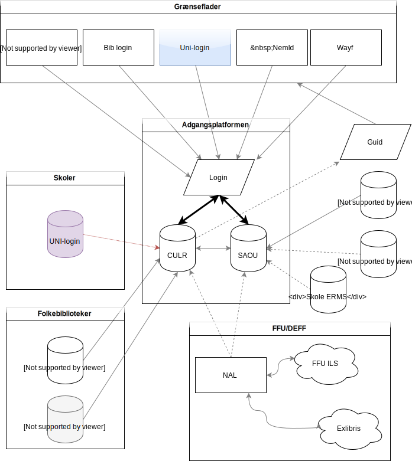
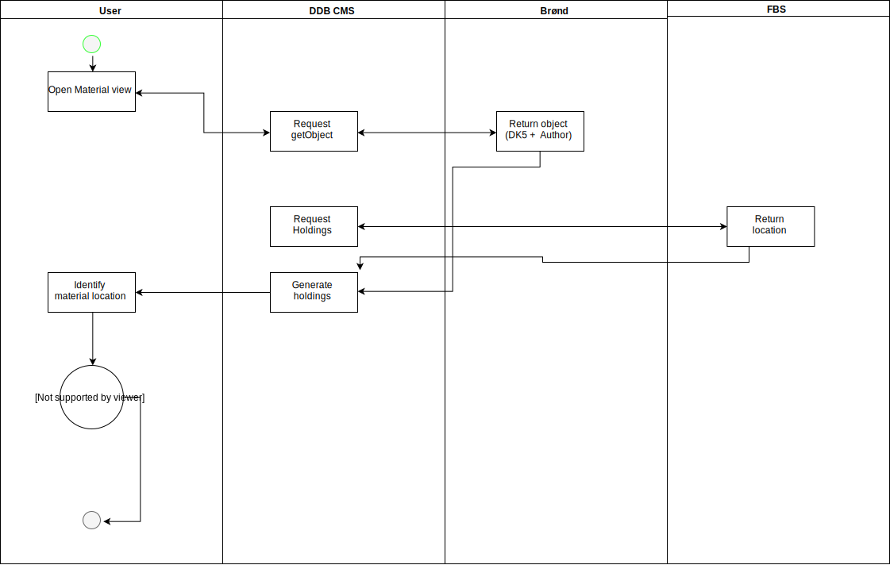
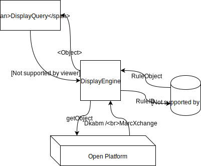
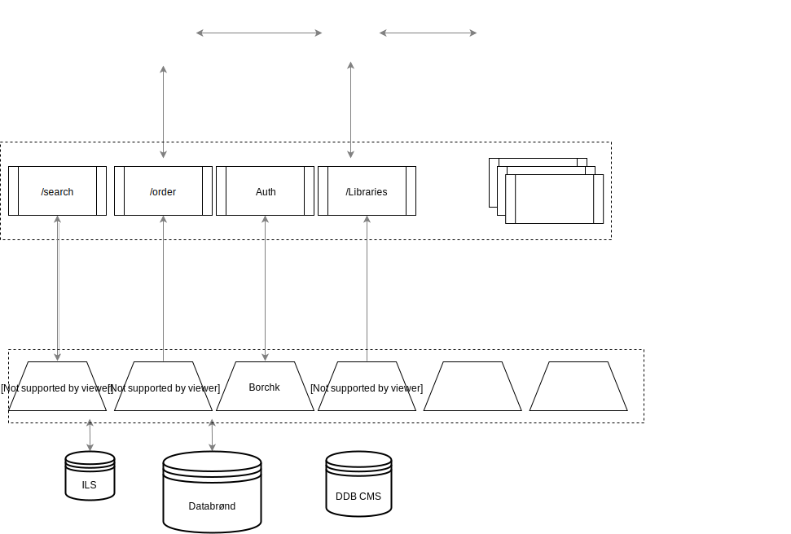
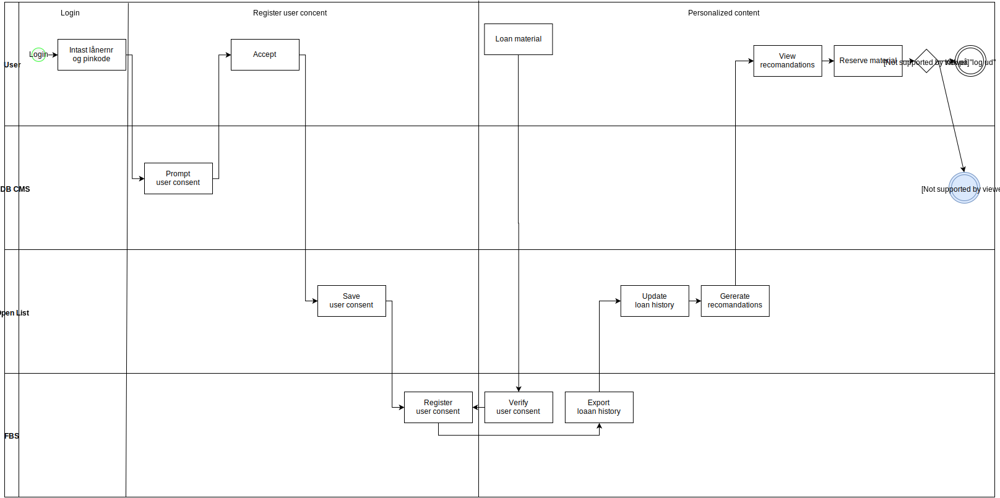
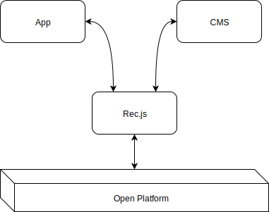
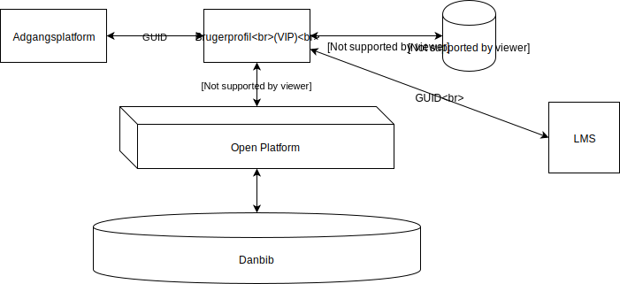
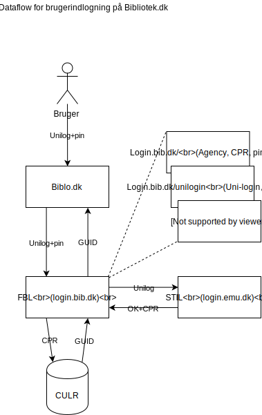

## maalarkitektur

### Adgangsstyring.svg
Rolf?. Components: 

### DDBCMS.2016-06-17.OpenPlatform.svg
Rolf? Tomt diagram

### Materialevisning-Beholdning.svg)
Sekvens: Materialevisning

### OpenFormat.svg)

### OpenFormatExample.md

### Personalsering-user_consent.svg)

### Rec.js.svg)

### Untitled Diagram.xml)

### UserProfile.svg)

### UserProfile.xml)

### brugerlogin.biblo.svg)

### components.total.svg)

